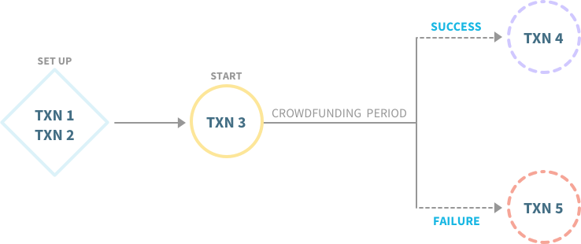

# 恒星智能合约

恒星可以用来建立复杂的智能合约。 智能合约是可以根据编程逻辑自动执行协议的计算机程序。

整合技术和法律合同的概念可以追溯到20世纪50年代，当时学者们建立了可以在不涉及传统法律程序的情况下执行
法律规则的计算方法。 智能合约在1997年由Nick Szabo正式定义：

>智能合约将协议与用户界面结合起来，从而在计算机网络上形成并保护关系。 这些系统设计的目标和原则来源于法律原则，经济理论以及可靠和安全协议的理论

近年来，区块链技术使得新一代智能合约具有不可变的协议存储，加密授权和价值整合转移。

对于恒星网络，智能合约表现为恒星智能合约。 恒星智能合约（SSC）表示为使用各种约束连接和执行的交易组合。
以下是创建SSC时可以考虑和实施的约束示例：

- *多重签名* - 需要哪些密钥来授权某个操作？ 为了执行这些步骤，哪些参与方需要就某一情况达成一致？

多重签名是需要多方签名才能签署帐户交易的概念。通过签名权重和阈值，创建签名中权力的表示。

- *批处理/原子性* - 哪些操作必须同时发生或失败？为了迫使它失败或通过，必须发生什么？

批处理是在一个事务中包含多个操作的概念。原子性是保证在一系列操作中，如果一次操作失败时提交给网络，
交易中的所有操作都将失败。

- *序列* - 应按照什么顺序处理一系列交易？什么是限制和依赖关系？

序列的概念通过序列号在恒星网络上表示。在事务处理中使用序列号，可以保证如果提交了替代事务，
则特定事务不会成功。

- *时间界限* - 什么时候可以处理交易？

时间限制是交易有效期限的限制。使用时间范围可以在SSC中表示时间限制。

本概述介绍了可用于在恒星网络上创建SSC的两种常见设计模式。
这些交易可以转换成API请求或可以使用恒星实验室( Stellar Laboratory)执行。

## 带时间锁定和恢复的两方签名托管账户

#### 用例场景

Ben Bitdiddle向Alyssa P. Hacker出售50个CODE代币，条件是Alyssa在一年内不会转售代币。
Ben并不完全信任Alyssa，所以他建议他持有Alyssa一年的代币。

Alyssa抗议。 她怎么会知道Ben在一年后仍然会持有代币？ 她怎么能相信他最终将他们交付？

另外，Alyssa有时会忘记。 在年底的漫长等待期内，她有可能不记得要求她的代币。Ben希望建立一个恢复机制，
以便如果Alyssa不主动要回这些代币时，他们仍可以到期发送给Alyssa。 这样，代币永远不会丢失。

#### 实现

两个实体之间建立了一个托管协议：1. 源账户-为协议提供资金的实体和目标 2.目标账户-在合同到期时收到资金的实体

在双方之间执行一个时间锁定的托管合同需要三个帐户：源帐户，目标帐户和托管帐户。源帐户建立托管协议，
并为托管协议提供资金。目标账户是最终获得托管资金的账户。托管账户由源账户创建，并在锁定期间持有托管资金。

此次托管协议确定两个时间段：

- 锁定期，任何一方当事人均不得操纵（转让，使用）资产；
- 恢复期，源账户有能力从托管账户收回托管资金。

五笔交易用于创建托管合同 - 下面按照创建顺序对其进行了说明。中将使用以下变量：

N，M - 托管账户和来源账户的序列号; N + 1表示下一个连续交易编号，依此类推
T - 锁定期
D - 锁定期开始的日期
R - 恢复期

对于下面描述的设计模式，被交换的资产是本地资产。 向Stellar网络提交交易的顺序与创建顺序不同。 以下是关于时间的提交顺序：

**TN1：创建托管账户**

**帐户：**源帐户

**序列号：**M

**操作：**

- 创建账户：在系统中创建托管账户

    *起始余额：最低余额+交易费用*

**签名者：**源帐户

TN1通过源账户创建托管账户,并以当前最低储备金为该账户提供资金。此时，原账户可访问托管账户的公钥和私钥。
托管账户由最低余额供资，因此它是网络上的有效帐户。 在托管协议结束时，处理转让资产会让它得到额外的资金。
建议在创建新账户时，使用余额大于计算起始余额的源账户提供资金。

**TN2：启用多方签名**

**帐户：**托管帐户

**序号：**N

**操作：**

- 设置签名者：添加目标账户作为签署者，并对托管账户的交易加权
    *权重：1*

- 设置阈值和权重：设置主密钥权重，并且更改阈值权重要求所有签名（2个签名者中的2个）
    *主密钥权重：1*
    *低阈值：2*
    *中等阈值：2*
    *高阈值：2*
 
**签名者：**托管账户

TN2被创建并提交给网络。这是通过使用托管账户的源账户完成的，因为源账户现在可以控制托管账户。
第一个设置，将目标帐户添加为托管帐户的第二个签名者，并且签名权重为1。

通常情况下，阈值不均匀。第二个设置，将主密钥的权重置为1，使其与目标帐户的权重一样。
同时，阈值被设置为2。这使得从托管账户发起的所有交易现在要求所有签名具有总权重2。
在这一点上，与两者签署的权重托管帐户和目标帐户合计为2.这确保从此时起，
托管帐户和目标帐户（源和目标）都必须签署与托管帐户相关的所有交易。
这将托管账户的部分控制权交给了目标。

**TN3：解锁**

**帐户：**托管帐户

**序列号：**N + 1

**操作：**

- 设置阈值和权重：设置主密钥的权重并更改阈值权重以仅需要1个签名
    *主密钥权重：0*
    *低阈值：1*
    *中等阈值：1*
    *高阈值：1*

**时间界限：**

- 最短时间：解锁日期

- 最大时间：0

**立即签名者：**托管账户

**最终签名者：**目标帐户

**TN4：恢复**

**帐户：**托管帐户

**序列号：**N + 1

**操作：**

- 设置签名者：将目标帐户作为签名者移除
   
    *权重：0*

- 设置阈值和权重：设置主密钥的权重并更改阈值权重以仅需要1个签名

    *低阈值：1*

    *中等阈值：1*

    *高阈值：1*

**时间界限：**

- 最短时间：恢复日期

- 最大时间：0
- 立即签署人：托管账户
- 最终签名者：目的地帐户

TN3和TN4由托管账户创建。源账户然后以XDR形式来让目标账户签名。目标账户然后将它们发布，保存在安全位置。
双方签署后，这些交易不能修改。源账户和目标账户都以XDR形式保存为副本。交易存储在可公开访问的位置，
而不用担心被篡改。

TN3和TN4在托管账户被资助之前被创建和签署，并且具有相同的交易号码。这样做是为了确保双方达成一致。
如果在提交这两笔交易中的一笔交易之前情况发生变化，源账户和目标账户都需要通过托管账户授权交易。
这由目标账户和托管账户的签名要求来规定的。

TN3移除托管帐户。此交易将托管帐户的控制权完全转移给目标。在锁定时间结束后，从托管帐户交易签名就只有目标账
户了。解锁日期（D + T）是解锁交易可以提交的第一个日期。如果TN3在解锁日期之前提交，交易将无效。
最大时间设置为0，表示交易没有到期日期。

TN4用于目标未提交解锁交易的情况下的账户恢复。它将目标帐户作为签名者移除，并重置签名事务的权重以仅需要自己
的签名。这会将托管帐户的完整控制权返还给源账户。TN4只能在恢复日期（D + T + R）之后提交，并且没有到期日期。

TN3可以在恢复期间的任何时间提交，如果目标账户没有提交TN3以获得托管账户中的资金，则源账户可以在恢复日期
之后提交TN4。如果需要，源账户可以回收锁定的资产，因为TN4不再需要目标账户为托管账户交易签名。
在恢复日期之后，TN3和TN4都是有效的并且能够提交给网络，但网络仅接受一个交易。
这是由两个事务具有相同序列号的功能所保证的。

总结：如果TN3没有被目标提交，则TN4在恢复期之后由原始提交。

**TN5：资助**

**帐户：**源帐户

**序列号：**M + 1

**操作：**

- 付款：向托管账户支付适当的资产金额

**签名者：**源帐户

TN5是将适当数量的资产从源账户存入托管账户的交易。 应在TN3和TN4已由目标账户签名并发回原始账户后提交。

## 联合实体众筹

#### 用例场景

Alyssa P. Hacker需要筹集资金来支付一家公司的服务，但她希望通过众筹获得公众的资金。如果有足够的人捐赠，
她将能够直接向公司支付服务费用。如果没有，她将有一个机制来返还捐款。为了保证她对捐助者的信任和可靠，她决定
询问Ben Bitdiddle是否愿意帮助她让人们参与众筹。Ben还会向他的朋友提供Alyssa的信用背书，以促进他的朋友们
捐款。

#### 实现

最简单的众筹智能合约至少需要三方：其中两个（从这里称为A方和B方）同意赞助众筹，第三方将提供最终资金（
称为目标）。必须创建一个代币作为执行众筹的机制。所使用的代币以及持有账户必须由双方之一创建。持有账户发行的
代币可按每个代币的任何价格定价。持股账户收集资金，在众筹结束后，如果价值目标未得到满足，将返还供款者资金。

五笔交易用于创建该众筹合同。以下变量用于解释合同的表述：

N，M - 分别为甲方账户和持有账户的序号; N + 1表示下一个连续交易编号，依此类推

V - 众筹活动正在筹集的总价值

X - 销售令牌的价值

有四个帐户用于创建基本的众筹模式。首先是持股账户，即处理与捐赠者收集和互动的账户。它需要A方和B方签署才能进
行任何交易。第二个是目标账户，即成功获得众筹价值的目标所拥有的账户。这两个是A方和B方共同拥有的账户。

创建这种设计模式的交易可以由赞助众筹活动的任何一方创建和提交。交易按创建顺序呈现。提交给恒星网络的顺序是
条件的，取决于众筹活动的成功。

**TN1：创建holding账户**

**帐户：** A

**序列号：**M

**操作：**

- 创建账户：在系统中创建holding账户
    *起始余额：最小余额*
    
**签署人：** A

**TN2：添加签名者**

**帐户：**holding帐户

**序号：**N

**操作：**

- 设置签名者：添加A方作为签署者，并对托管帐户的交易加权
    *权重：1*
    
- 设置签名者：添加B方作为签署者，并对托管帐户的交易加权
    *权重：1*
    
- 设置阈值和权重：删除主密钥并更改阈值权重以要求所有其他签名（2个签名人中的2个）
    
    *主体权重：0*
    
    *低阈值：2*
    
    *中等阈值：2*
    
    *高阈值：2*

**签署者：**holding账户

TN1和T2由赞助众筹活动的两方之一创建并提交。TN1创建持有账户。持有账户的资金来源为起始余额，以使其在网络上有效。

TN2取消持有账户作为自己交易的签署者，并将A方和B方添加为签名者。从这时起，所有相关方必须同意并签署来自holding账户的所有交易。这种信任机制可以保护捐助者免受一方携带恶意行为的侵害。

在TN2后，holding账户应获得用于众筹活动的代币资金以及足够的lumens来支付以下所有交易的交易费用。

**TN3：开始众筹**

**帐户：** holding帐户

**序列号：**N + 1

**操作：**

- 卖出：以每个代币X的价格出售代币

**签名者：** party A账户，party B账户

TN3被创建并提交给网络以开始众筹活动。 它在网络上创建一个报价，以每个令牌X的价格出售参与令牌。 鉴于为众筹活动创建的令牌数量有限，
令牌的定价方式可以通过销售来提供总V的价值。

**TN4：众筹成功**

**帐户：** holding帐户

**序列号：**N + 2

**操作：**

- 付款：将V从holding账户发送到goal账户

**时间限制：**

- 最短时间：众筹期结束
- 最大时间：0

**签名者：** A帐户，B帐户

**交易5：众筹失败**

**帐户：**holding帐户

**序列号：**N + 3

**操作：**

- 取消：取消预先存在的代币
- 购买：持有账户以每令牌X的价格购买代币

**时间限制：**

- 最短时间：众筹期结束
- 最大时间：0
- 签名者：A帐户，B帐户

TN4和TN5这两笔交易都有一个在众筹期结束的最短时间，以防止它们提前被提交方。众筹结束后，任何人都可以提交。TN4将筹集的金额转入goal账户。TN5通过取消要约来防止所有剩余的代币被出售，并且使得捐赠者能够创建回售代币给holding账户。

交易4的序列号是N + 2，交易5的序列号是N + 3。这些连续的序列号要求TN4和TN5都以适当的顺序提交给网络。这样提供了安全性。

当预计日期没有募集到足够的资金时，众筹是失败的。这相当于不销售所有参与代币。TN4提交给网络，但会失败。holding账户有足够的lumens支付交易费用，因此交易将被认为是一致的，并且序列号将被使用。但是，会发生错误，因为帐户中没有足够的资金来支付实际请求的付款金额。TN5然后被提交给网络，使捐助者能够回售他们的代币。此外，TN5取消了holding账户出售代币的能力，从而停止了众筹活动的状态。

如果众筹结束，筹集了足够资金V，众筹成功。 TN4提交给网络，并且会成功，因为帐户中有足够的资金来完成支付操作。 TN5将被提交给网络，但会失败。 holding账户将有足够的luments支付交易费用,交易会成功。但由于holding账户将没有资金购回代币，捐助者将无法尝试收回资
金。

**众筹捐款者**

以下是捐款者参与众筹步骤：

1.为代币的holding账户创建一个信任

2.创建一个购买参与代币购买参与代币的提议

*捐款者账户将收到代币，holding账户将收到价值*

3.众筹：

*成功 - 什么也不做

*失败 - 创建代币回购的要约，使捐助者收回投资

## SSC最佳实践

设计一个智能合同，各方必须聚在一起，清楚地勾画合同的目的、各方之间的合作以及期望的结果。 应该商定明确的条件和结果。
确定条件及其结果后，合同可以转化为一系列的运作和交易。 提醒一下，智能合约是使用代码创建的。 代码可能包含错误或者可能
无法按预期执行。 在提出智能合约的条件和结果时，务必分析所有可能的边缘情况。

    